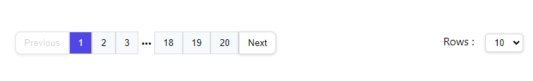

# Reactjs-Pagination

simple configurable pagination component built with `React js`.

<div align="center">
  
</div>

## Installation

```code
npm install --save reactjs-pagination
```

or

```code
yarn add reactjs-pagination
```

## Usage

```javascript
import React, { useEffect, useState } from "react";
import Pagination from "reactjs-pagination";

export default function Example() {
  const [data, setData] = useState({
    page: 1,
    take: 10,
  });
  const totalItmes = 200; // get it from server-side

  return <Pagination totalItmes={totalItmes} state={data} setState={setData} />;
}
```

## Availble props

<table>
    <thead>
    <tr>
        <th>Name</th>
        <th style="text-align:center">Type</th>
        <th style="text-align:center">Default</th>
        <th>required</th>
    </tr>
    </thead>
    <tbody>
    <tr>
        <td>totalItmes</td>
        <td style="text-align:center">Number (int)</td>
        <td style="text-align:center">null</td>
        <td>true</td>
    </tr>
    <tr>
        <td>state</td>
        <td style="text-align:center">React.State <br/>//ex: {page(int or string):1,take(int or string):1}</td>
        <td style="text-align:center">null</td>
        <td>true</td>
    </tr>
    <tr>
        <td>setState</td>
        <td style="text-align:center">React.setState</td>
        <td style="text-align:center">null</td>
        <td>true</td>
    </tr>
    <tr>
        <td>loading</td>
        <td style="text-align:center">Boolean</td>
        <td style="text-align:center">false</td>
        <td>false</td>
    </tr>
    <tr>
        <td>activeClassName</td>
        <td style="text-align:center">String</td>
        <td style="text-align:center">null</td>
        <td>false</td>
    </tr>
    <tr>
        <td>pageItemsClassName</td>
        <td style="text-align:center">String</td>
        <td style="text-align:center">null</td>
        <td>false</td>
    </tr>
    <tr>
        <td>buttonsClassName</td>
        <td style="text-align:center">String</td>
        <td style="text-align:center">null</td>
        <td>false</td>
    </tr>
    <tr>
        <td>buttonsText</td>
        <td style="text-align:center">Object<br/>//ex: {{ prev: "<<", next: ">>" }} or you can use Icons</td>
        <td style="text-align:center">null</td>
        <td>false</td>
    </tr>
    <tr>
        <td>takeChangerCounts</td>
        <td style="text-align:center">Array <br/>//ex: [10,50,100]</td>
        <td style="text-align:center">null</td>
        <td>false</td>
    </tr>
    <tr>
        <td>showTakeChanger</td>
        <td style="text-align:center">Boolean</td>
        <td style="text-align:center">true</td>
        <td>false</td>
    </tr>
    <tr>
        <td>takeChangerClassName</td>
        <td style="text-align:center">String</td>
        <td style="text-align:center">null</td>
        <td>false</td>
    </tr>
    <tr>
        <td>takeChangerText</td>
        <td style="text-align:center">String <br/>//ex: "Rows"</td>
        <td style="text-align:center">null</td>
        <td>false</td>
    </tr>
    </tbody>
</table>
